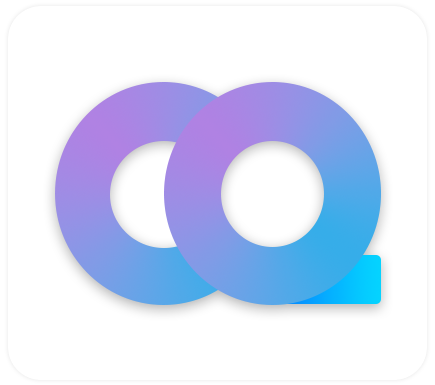

<div align="center">



# EleCho.GoCqHttpSdk

_✨ 专为 [Go-CqHttp](https://github.com/Mrs4s/go-cqhttp) 打造的, 便捷与优雅的通信 SDK ✨_

 


</div>

## 📖 简介:

虽然有很多的 OneBot 通信 SDK, 但没有一个是专为 `go-cqhttp` 打造的 .NET SDK. 秉持着 C# 的优雅开发理念, 这个库诞生了.

用户可以享受到完全遵守 C# 编码风格, 高度封装的各种接口, 以及优化过命名的接口, 事件, 数据成员, 枚举类型等.

> 如果你不了解 `go-cqhttp`, 可以从这里了解一下: [go-cqhttp 文档](https://docs.go-cqhttp.org/) / [go-cqhttp 仓库](https://github.com/Mrs4s/go-cqhttp)

## 🚀 使用:

你可以在 nuget.org 下载到本库的发布包, 也可以直接在 Visual Studio 中为项目添加引用.

> 目前库仍处于开发阶段, 你需要勾选 "包含预发布版本" 才能搜索到结果

> 通信协议支持: 正反向 HTTP 与正向 WebSocket. \
> 上报格式支持: `array(json)`, `string`. \
> 功能支持: CqCode 转码, API 快速操作 \
> 设计模式: 上报为中间件模式, 同时也支持基于中间件的插件

### 🔗 连接

要与 go-cqhttp 建立一个 WebSocket 连接, 需要使用位于 `EleCho.GoCqHttpSdk` 命名空间下的 `CqWsSession` 来创建一个会话

```csharp
// 初始化一个 CqWsSession 用来与 go-cqhttp
CqWsSession session = new CqWsSession(new CqWsSessionOptions()
{
    BaseUri = new Uri("ws://127.0.0.1:6700"),  // WebSocket 地址
    UseApiEndPoint = true,                     // 使用 api 终结点
    UseEventEndPoint = true,                   // 使用事件终结点
});
session.Start(); //开始连接
```

> 指定 *UseApiEndPoint* 和 *UseEventEndPoint* 将使用独立的 api 和 event 套接字来单独处理功能调用以及事件处理
> 参考文档: [Onebot11:正向WebSocket](https://github.com/botuniverse/onebot-11/blob/master/communication/ws.md)

### 📩 上报

上报数据也就是所谓的 "事件", 所有继承了 `EleCho.GoCqHttpSdk.ICqPostSession` 接口的类都将处理上报数据, 该接口规定必须要有一个名为 *PostPipeline* 的 `CqPostPipeline` 成员

`CqPostPipeline` 是用户处理上报的途径, 它符合中间件设计模型, 你可以直接使用使用它添加中间件.

```csharp
CqWsSession session;   // 要处理上报数据的会话
session.PostPipeline.Use(async (context, next) =>
{
    // context 为上报数据的上下文, 其中包含了具体的信息
    
    // 在这里添加你的逻辑代码 //
    
    // next 是中间件管道中的下一个中间件, 
    // 如果你希望当中间件执行时, 不继续执行下一个中间件
    // 可以选择不执行 next
    await next();
});
```

上述订阅方法将会处理所有的上报, 我们更推荐使用 `EleCho.GoCqHttpSdk.CqPostContextExtensions` 类所提供的拓展方法, 通过它你可以非常便捷的处理任何具体类型的事件

```csharp
CqWsSession session;   // 要处理上报数据的会话
session.PostPipeline.UseGroupMessage(async (context, next) =>
{
    // context 为 CqGroupMessagePostContext, 其中包含了群聊消息的具体信息
    
    // 在这里添加你的逻辑代码 //
    
    // 简单实现一个复读机:
    if (context.RawMessage.StartsWith("echo "))
    {
        string msg = context.RawMessage.SubString(5);                  // 获取 "echo " 后的字符
        context.SendGroupMessageAsync(context.GroupId, new CqTextMsg(msg)); // 发送它 (关于消息发送后面会详细讲解)
    }
    
    await next();
});
```

### 📝 消息发送

所有继承了 `EleCho.GoCqHttpSdk.ICqActionSession` 接口的类都将具备使用 `Action` 的能力, 消息发送属于 `Action`, 该接口规定必须有一个名为 *ActionSender* 的 `CqActionSender` 成员

`CqActionSender` 是程序向 go-cqhttp 发送 "Action" 的途径, 其中需要实现 `CqAction` 的发送逻辑以及响应逻辑, 你可以直接使用它来调用任何 `CqAction`

```csharp
CqWsSession session;   // 要使用 Action 的会话
session.ActionSender.SendActionAsync(new CqSendGroupMessageAction(群聊ID, new CqMsg[] { new CqTextMsg("一个文本消息") }));
```

可以看到, 使用 *session.ActionSender* 直接发送 `Action` 的步骤比较繁琐, 所以同样的, 推荐使用拓展方法, 它们由 `EleCho.GoCqHttpSdk.CqActionSessionExtensions` 提供.

```csharp
CqWsSession session;   // 要使用 Action 的会话
context.SendGroupMessageAsync(群聊ID, new CqTextMsg("一个文本消息")); // 发送它 (关于消息发送后面会详细讲解)
```

> `EleCho.GoCqHttpSdk.CqActionSessionExtensions` 类不直接为 `CqActionSender` 类提供拓展, 你只能在实现了 `ICqActionSession` 接口的类上调用这些拓展方法

### 📦 使用插件

在本库中, 你可以为能够进行上报的会话添加插件, 它本质还是一个中间件, 但是插件中, 它分离了所有类型的上报. 如果要处理某种类型的上报, 只需要 override 对应的方法即可.

```csharp
class MyPostPlugin : CqPostPlugin
{
    public override async Task OnGroupMessageAsync(CqGroupMessagePostContext context)
    {
        if (context.Session is not ICqActionSession actionSession)   // 判断是否能够发送 Action
            return;
        
        string text = context.Message.GetText();
        if (text.StartsWith("TTS:", StringComparison.OrdinalIgnoreCase))
        {
            await actionSession.SendGroupMessageAsync(context.GroupId, new CqTtsMsg(text[4..]));
        }
        else if (text.StartsWith("ToFace:"))
        {
            if (CqFaceMsg.FromName(text[7..]) is CqFaceMsg face)
            
            await actionSession.SendGroupMessageAsync(context.GroupId, face);
        }
    }

    public override async Task OnGroupMessageRecalledAsync(CqGroupMessageRecalledPostContext context)
    {
        if (context.Session is not ICqActionSession actionSession)   // 判断是否能够发送 Action
            return;

        var msg = (await actionSession.GetMessageAsync(context.MessageId));

        await actionSession.SendGroupMessageAsync(context.GroupId, CqMsg.Chain("让我康康你撤回了什么: ", msg.Message));
    }
}
```

它的使用也非常简单, 只需要在会话上调用 `UsePlugin` 方法即可

```csharp
session.UsePlugin(new MyPostPlugin());
```

> 与 ICqPostSession 的拓展方法 Use 不同, 一个插件拥有处理多种类型上报的能力, 但它本质是单个中间件, 而诸如 UseGroupMessage 这种拓展方法, 在使用的时候, 会创建一个新的中间件并添加到上报处理管线.

### 📎 小提示

1. `CqMsg` 类中包含了对于消息的一写帮助方法, 例如将多个 CqMsg 拼合为一个 CqMsg[], 或者从 CQ 码转换为 CqMsg[]
2. `CqFaceMsg` 是 QQ 小黄脸消息, 它还提供了从中文名称转换为对应类型的方法, 例如 "斜眼笑", "可怜" 等中文名称.
3. 上报中的 `QuickOperation` 是不推荐使用的, 除非你使用的是反向 HTTP, 这是因为在 WebSocket 中, 快速操作是模拟出来的

### 📃 近期计划:

1. 实现反向 WebSocket 通信
2. 实现所有 Action

## 🧬 项目

### 💼 关于数据结构

因为 `go-cqhttp` 给的数据, JSON 都是小驼峰, 并且为了用户操作上的便捷, 所以 JSON 解析上使用了以下方法:

1. 分为用户的操作类和具体调用时使用的 Model 类
2. 在调用接口, 或者解析上报的时候, 两种类会相互转换
3. 一些原始 Model 类中的 `data` 字段, 或者 `params` 字段, 他们在用户的操作类中直接作为类型成员存在, 而不独立分出一个 `data` 或 `params` 成员存放.

同时, 为了用户操作的便捷, 用户所操作的类与实际传输使用的类, 字段格式是不一样的, 例如在 Music 消息中 sub_type 表示该 Music 消息的音乐类型, 于是在用户的操作类中, 它使用 MusicType 命名.

#### 📄 消息

首先是 `go-cqhttp` 中的基础消息类型, 也就是 CQ 码(CQ Code):

它的 JSON 格式是这样的:

```json
{
    "type": "消息类型",
    "data": {
        // 消息的数据
    }
}
```

如果让用户访问 data 然后访问它的成员, 肯定有些繁琐, 所以在用户操作的类中, 是这样的:
```csharp
public class CqXxxMsg : CqMsg
{
    public override string Type => "消息类型";  // Type 是不允许用户修改的, 一个类型对应一个 Type
    
    // 直接将消息数据作为消息的成员
}
```

#### 📥 上报

上报的原始数据 JSON 格式中, 并没有专门为数据抽出一个 data 字段, 所以不做特殊处理.

#### ✋ Action

Action 在 go-cqhttp 中的 JSON 格式与消息类似, 它为参数抽出了一个 params 字段, 然后将所有参数放在这个字段中. 所以在这方面, 做了与消息类型近似的处理, 也就是直接将参数独立出来, 而不是放在 params 字段中.

同样, ActionResult(Action 调用的返回结果) 也将数据放在了 data 字段中, 所以同样做了特殊处理.

## 🎉 贡献

关于任何对项目上的意见, 例如命名, 设计模式, 或者其他任何方面的问题, 直接提交一个 discussion 就可以啦, 然后咱们就可以讨论讨论具体要采取什么措施啦. ψ(｀∇´)ψ

如果你有什么好的想法, 也可以直接提交一个 PR, 我们一起来完善这个项目吧!

> 球球了, 有问题请直接提出来, 不要犹豫, 咱真的很需要用户意见, 尤其是如何提升这个库的 "优雅程度".

### 📚 编写规范

下面是编写时可能提供帮助的一些规范:

> 虽然库的有些内部代码真的很丑(例如命名), 但这是为了外部访问的便捷而做出的妥协, 实属无奈之举.

#### 🗂️ 各个文件夹的内容

- `/Action` : 用户要使用到的各种 CqAction
- `/Action/Sender` : 用来发送 CqAction 的各个协议实现
- `/Action/Model/Params` : CqAction 进行调用时所需要的具体参数 (用户不可见)
- `/Action/Result` : 用户要使用到的各种 CqActionResult
- `/Action/Result/Model/Data` : CqActionResult 返回时要读取的具体数据 (用户不可见)
- `/DataStructure` : CqAction 参数或返回数据中所使用到的各种结构
- `/DataStructure/Model` : CqAction 参数或返回数据中所使用到的各种结构的实际传输声明 (用户不可见)
- `/Enumeration` : 各种枚举类型
- `/Extension` : 各种拓展方法
- `/JsonConverter` : 程序集所需要使用的 JSON 转换器 (用户不可见)
- `/Message` : 用户会用到的各种消息类型
- `/Message/CqCodeDef` : CQ 码操作类
- `/Message/DataModel` : 消息的实际传输数据模型 (用户不可见)
- `/Message/JsonConverter` : 某些特殊消息需要使用到的 JSON 转换器 (用户不可见)
- `/Post` : 消息上报的各种类型
- `/Utils` : 各种工具类
- `/` : 被用户直接访问, 不需要进行归类的内容

#### 🛠️ 编写步骤

编写一个 Action 的参考步骤:

1. 添加 `CqActionType` 成员
2. 添加 `Consts.ActionType` 成员
3. 在 `CqEnum` 中实现 `CqActionType` 转字符串
4. 编写它的 `CqAction` 类
5. 编写它的 `CqActionParamsModel` 类 (internal, 有一个全参构造函数, 成员名称为原始名称)
6. 编写它的 `CqActionResult` 类 (不能有公开构造函数, 因为用户不能创建它的实例)
7. 编写它的 `CqActionResultDataModel` 类 (internal, 只有 JSON 构造函数, 成员名称为原始名称)
8. 实现 `CqActionResult.FromRaw`
9. 实现 `CqActionResultDataModel.FromRaw`
10. 在 `CqActionSessionExtensions` 中添加对应拓展方法

编写一个 CqMsg 的参考步骤:

1. 添加 `CqMsgType` 成员
2. 编写它的 `CqMsg` 类
3. 编写它的 `CqMsgDataModel` 类 (internal, 一个无参构造函数, 一个全参构造函数)
4. 实现它在 `CqMsgModelConverter` 中的转换
5. 实现它在 `CqCode.ModelChainFromCqCodeString` 中的转换

#### 📃 命名规范

- 尽量将缩写改为全称, 尽量将奇怪的名称改为正常的名称 \
  例如: SetGroupBan -> BanGroupMember (禁言群成员)
- 尽量将错误的名称改为正确的名称 \
  例如: CheckUrlSafely -> CheckUrlSafety (检查链接安全性)

#### 📎 类型声明提示

- 在原文档中以 `number` 标识的类型, 统一使用 `long`, 否则可能会溢出
- 在原文档中, 消息 ID 有的地方声明为 `int32`, 有的地方声明为 `int64`, 在本库中, 将统一使用 `int64`


